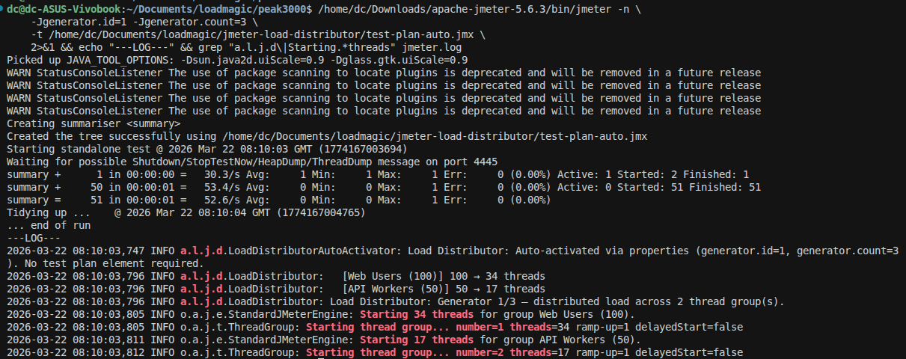

# JMeter Distributed Load Distributor

Automatically distributes thread counts across JMeter generators for distributed testing. Set your total desired load once, specify the number of generators at runtime, and each generator runs exactly its fair share.



## The Problem

In JMeter distributed testing, every generator runs the **full** thread count from the test plan:

- Test plan says 100 threads
- You start 4 generators
- Each runs 100 threads = **400 total** (not 100)

To get 100 total, you manually calculate 25 threads per generator and edit the test plan. If you add or remove a generator, you recalculate and edit again.

## The Solution

Drop this plugin into `lib/ext/`. No test plan changes needed.

### JMeter Distributed Testing (master/slave)

Add one flag to your existing master command:

```bash
jmeter -n -t test.jmx -R slave1,slave2,slave3 \
  -Ggenerator.hosts=slave1,slave2,slave3
```

Each slave auto-detects its hostname in the list and calculates its share. That's it.

### Standalone Generators

For independently-launched generators (Docker, Kubernetes, CI, etc.):

```bash
# Generator 1 of 3
jmeter -Jgenerator.id=1 -Jgenerator.count=3 -n -t test.jmx

# Generator 2 of 3
jmeter -Jgenerator.id=2 -Jgenerator.count=3 -n -t test.jmx

# Generator 3 of 3
jmeter -Jgenerator.id=3 -Jgenerator.count=3 -n -t test.jmx
```

Either way, each generator calculates its exact share. The test plan stays unchanged.

## How It Works

The plugin runs at test start (before any threads are created) and adjusts each ThreadGroup's thread count:

```
Test plan: 100 threads, 3 generators

Generator 1: 34 threads
Generator 2: 33 threads
Generator 3: 33 threads
Total:       100 (exact)
```

Remainder threads are distributed to lower-numbered generators. The sum across all generators **always equals the original total** — no rounding errors, no lost threads.

### More Generators Than Threads

```
Test plan: 4 threads, 5 generators

Generator 1: 1 thread
Generator 2: 1 thread
Generator 3: 1 thread
Generator 4: 1 thread
Generator 5: 0 threads (sits this one out)
```

## Supported Thread Groups

| Thread Group | Support |
|---|---|
| **Standard ThreadGroup** | Full — thread count distributed |
| **Ultimate Thread Group** | Full — each schedule row distributed independently |
| **Concurrency Thread Group** | Full — target level distributed |
| **Stepping Thread Group** | Full — thread count distributed |

### Ultimate Thread Group Example

```
Schedule (3 generators):
  Row 1: 50 threads, 30s ramp, 120s hold
  Row 2: 100 threads, 60s ramp, 300s hold

Generator 2 gets:
  Row 1: 17 threads, 30s ramp, 120s hold
  Row 2: 33 threads, 60s ramp, 300s hold

Timings unchanged — only thread counts divided.
```

## Requirements

- **Java 11 or later** (the plugin is compiled with target Java 11)
- **JMeter 5.0+** (tested with 5.6.3)

## Installation

1. Download `jmeter-load-distributor-1.2.0.jar` from [Releases](https://github.com/loadmagic/jmeter-load-distributor/releases)
2. Copy to `<jmeter>/lib/ext/`
3. Restart JMeter

Or install via JMeter Plugins Manager (coming soon).

## Usage

The plugin auto-activates when it detects any of these properties:

| Property | Flag | Description |
|---|---|---|
| `generator.hosts` | `-G` (sent to all slaves) | Comma-separated list of slave hostnames — each slave auto-detects its position |
| `generator.id` | `-J` (per generator) | This generator's numeric ID (1-based) |
| `generator.count` | `-J` (per generator) | Total number of generators |

`generator.hosts` is the simplest for distributed testing — one flag on the master. `generator.id` + `generator.count` gives explicit control for standalone setups.

### Without the Properties

If you run without any generator properties, the plugin does nothing — your test runs at full load. This means the same .jmx works for both single-node and distributed testing.

### Config Element (optional)

For backward compatibility, you can still add the plugin as a Config Element: right-click **Test Plan** → **Add** → **Config Element** → **Distributed Load Distributor**. If both auto-activation and the Config Element are present, distribution runs only once.

## Non-Destructive

Thread count modifications are **in-memory only**. JMeter's running version mechanism automatically restores original values when the test ends. Your .jmx file is never modified.

## Building from Source

```bash
mvn clean package
```

The JAR is at `target/jmeter-load-distributor-1.2.0.jar`.

## License

Apache License 2.0 — same as JMeter.

## Author

[LoadMagic](https://loadmagic.ai) — AI-powered performance testing.
